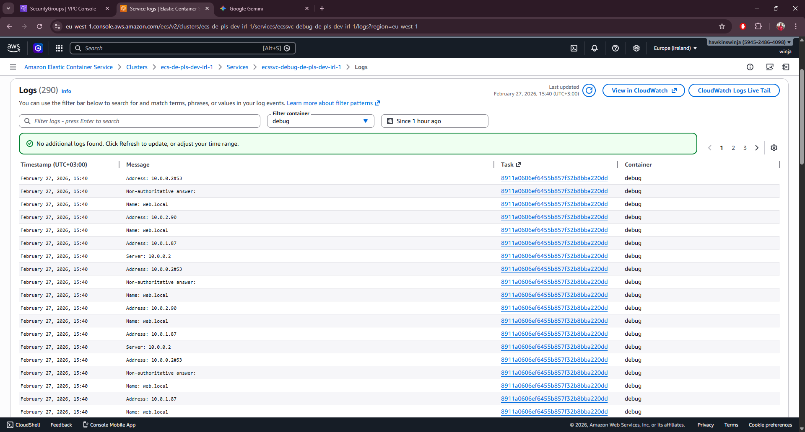
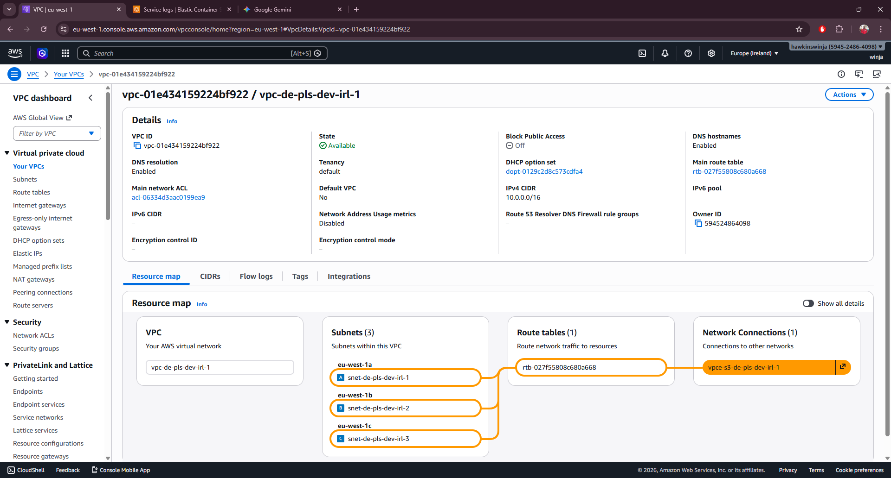

# ECS Private Architecture with Service Discovery

## Architecture Overview

This Terraform configuration deploys a fully private ECS Fargate environment with:

- **VPC**: 3 private subnets across 3 AZs (no public subnets, no internet gateway)
- **VPC Endpoints**: ECR API, ECR Docker, S3 Gateway, ECS, ECS Telemetry, CloudWatch Logs
- **ECR**: Standard tier repositories for web and debug services
- **ECS Cluster**: Fargate compute with two services (web, debug)
- **Service Discovery**: Private DNS namespace for internal service communication

## Naming Convention

Resources follow the pattern: `resourcetype-org-unit-environment-region-instancecount`

Example: `ecs-de-pls-dev-irl-1`

- **org**: de (organization)
- **unit**: pls (business unit)
- **environment**: dev
- **region**: irl (Ireland/eu-west-1)
- **instancecount**: 1, 2, 3...

## Traffic Flow

Debug container is used to verify that dns resolution resolves to internal ip address for the web task

All traffic stays within the VPC. No internet access required.

## Module Structure

```
ECS/
├── main.tf                    # Root module
├── variables.tf               # Input variables
├── outputs.tf                 # Outputs
└── modules/
    ├── vpc/                   # VPC, subnets, VPC endpoints
    ├── ecr/                   # ECR repositories
    ├── security-groups/       # Security groups for services
    ├── service-discovery/     # AWS Cloud Map configuration
    └── ecs/                   # ECS cluster, task definitions, services
```

## Prerequisites

1. AWS CLI configured with appropriate credentials
2. Terraform >= 1.13.3
3. Docker images pushed to ECR repositories (see below)
4. An existing s3 bucket to store state, otherwise comment the backend s3 and uncomment the backend local section

## Usage

### 1. Initialize Terraform

```bash
terraform init
```

### 2. Review and Customize Variables

Edit `variables.tf` or create `terraform.tfvars`:

```hcl
org         = "de"
unit        = "pls"
environment = "dev"
region      = "irl"
aws_region  = "eu-west-1"
```

### 3. Plan and Apply

```bash
terraform plan
terraform apply
terraform outputs
```

### 4. Push Docker Images to ECR

After infrastructure is created, authenticate and push images:

```bash
# Get ECR login
aws ecr get-login-password --region eu-west-1 | docker login --username AWS --password-stdin <account-id>.dkr.ecr.eu-west-1.amazonaws.com

# Tag and push web image, the web-ecr-url is part of the terraform output command ran previously
docker tag httpd:trixie <web-ecr-url>:latest
docker push <web-ecr-url>:latest

# Tag and push debug image, the debug-ecr-url is part of the terraform output command ran previously
docker tag debug:latest <debug-ecr-url>:latest
docker push <debug-ecr-url>:latest
```

### 5. Service Communication

Services communicate using DNS names:

- Web service: `web.local:80`

Example from debug container command, which output can be verified from the logs
```bash
nslookup web.local
```

 

## Key Features

### Zero Internet Traffic
-  All traffic stays within VPC, no NAT Gateway or Internet Gateway
- All AWS service access via VPC endpoints
- S3 Gateway endpoint for ECR image layers (free)
- VPC endpoints SG can be restricted only to aws s3 prefix list for more airtight environment



## Outputs

After deployment:

```bash
terraform output
```

Returns:
- VPC ID
- ECS cluster name
- Service names
- ECR repository URLs
- Service discovery namespace

## Clean Up

Note: Ensure ECR repositories are empty before destroying.

```bash
terraform destroy
```
